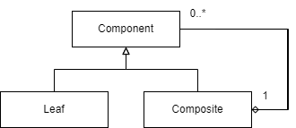

# Structural Design Patterns

## Adapter Design Pattern

This pattern is mainly used to use the old/legacy code with same interface.

Suppose that there is an `App` class that utilizes a class called `OldEmployee`. This old employee class implements an interface which has following methods:

```java
Employee {
	getId() : String
	getFirstName() : String
	getLastName() : String
}
```

Now due to new specification and demand in business logic, the new class is going to be `NewEmployee` which will not implement the methods that `OldEmployee` class implements. Instead the `NewEmployee` class will have following methods:

```java
NewEmployee {
	getId() : int
	getFirstName() : String
	getSurname() : String
}
```

This creates a problem because `App` class might still be using logic of the `OldEmployee` methods like `getLastName()` which is no longer available in the new class. To solve this issue, we will create an adapter class which is like a wrapper over the `NewEmployee` that will act similar to the `OldEmployee` but under the hood will be calling the methods of the new class. The implementation of the adapter is as follows:

```java
NewEmployeeAdapter implements Employee {
	NewEmployee emp;
	
	NewEmployeeAdapter(NewEmployee emp) {
		this.emp = emp;
	}
	
	getId() {
		return String.valueOf(emp.getId()); // int returned by new, String by old
	}
	
	getFirstName() {
		return emp.getFirstName();
	}
	
	getLastName() {
		return emp.getSurname();
	}
}
```

And now we can use the same logic in `App` class for `NewEmployee` as we did for `OldEmployee` without changing anything in the implementation of `App` business logic.

## Composite Design Pattern



This pattern is mainly used to denote the objects as a tree hierarchy. Example of this is in Java AWT library where each class or widget derive from the parent Component. And each component can be a collection of more components.

How to begin: Create an abstract class `Component` for all the objects in the system.

```java
package com.amrit.designpatterns.structural.composite;

import java.util.ArrayList;
import java.util.List;

public abstract class Component {
	String name;
	String url;

	List<Component> children = new ArrayList<>();

	public String getName() {
		return name;
	}

	public String getUrl() {
		return url;
	}

	public void add(Component c) {
		throw new UnsupportedOperationException("This operation is not supported");
	}

	public void remove(Component c) {
		throw new UnsupportedOperationException("This operation is not supported");
	}

	public abstract String toString();
}
```

Now we can use this abstract class to create other objects and override methods wherever required.

Parent component:

```java
package com.amrit.designpatterns.structural.composite;

import java.util.Iterator;

public class Parent extends Component {

	public Parent(String name, String url) {
		this.name = name;
		this.url = url;
	}
	
	@Override
	public void add(Component c) {
		this.children.add(c);
	}
	
	@Override
	public void remove(Component c) {
		this.children.remove(c);
	}

	@Override
	public String toString() {
		StringBuilder sb = new StringBuilder();
		sb.append(this.name + "\n");
		Iterator<Component> itr = this.children.iterator();
		while (itr.hasNext()) {
			sb.append(itr.next().toString() + " ");
		}
		return sb.toString();
	}

}
```

And item object that goes inside parent:

```java
package com.amrit.designpatterns.structural.composite;

public class Item extends Component {

	public Item(String name, String url) {
		this.name = name;
		this.url = url;
	}

	@Override
	public String toString() {
		return this.name;
	}

}
```

And this is how it'll work:

```java
public static void main(String[] args) {
	Parent parent = new Parent("Parent", "");
	Item item1 = new Item("Item1", "");
	Item item2 = new Item("Item2", "");
	Item item3 = new Item("Item3", "");
	Item item4 = new Item("Item4", "");
	parent.add(item1);
	parent.add(item2);
	parent.add(item3);
	parent.add(item4);

	System.out.println(parent);
}
```

### Pitfalls

- Quite restrictive.
- Oversimplification.