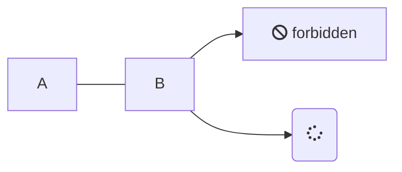

# Builder

> [!NOTE]
> Find source code [here](https://github.com/amritpandey23/design_patterns_java/tree/master/com.amrit.designpatterns.creational/src/com/amrit/designpatterns/creational/builder)

## Introduction

- People use it but never create their own.
- Used when object creation requires lot of parameters but has to set immutable after creation.

## Concepts

- Is constructor complex? Lots of parameters/getters/setters?
- Force immutability.
- Examples: StringBuilder, DocumentBuilder, Locale.Builder

## Why Builder Pattern?

- Immutability: How do we impose immutability to a bean java object? Answer: Remove the setters. But that's not the solution. Because here can only set the parameters only once.
- How do you force contract on creation of the object? Let's say an object allows three parameters but only two are required. Which two? Can we create 4 constructor for such scenario? This is known as telescoping constructor.

Hence, we need a object whoes job will only be to construct our object.

With a builder a java object now looks like this:

```java
public class Target{
	private T key;

	public Target(TargetBuilder builder) {
		this.key = builder.key;
	}

	public static class TargetBuilder {
		private T key;

		public TargetBuilder() {
		}

		public Target build() {
			return new Target(this);
		}

		public TargetBuilder setKey(T value) {
			this.key = value;
			return this;
		}
	}

	public T getKey() {
		return this.key;
	}
}
```

And this is how we use it:

```java
Target.TargetBuilder builder = new Target.TargetBuilder();
builder.setKey( ... );
Target target = builder.build();
```

Hence the builder becomes a precursor to create the target object. Here we are solving two things: Immutability and establishing contract.

Pitfalls: Strict design pattern with concrete rules.


