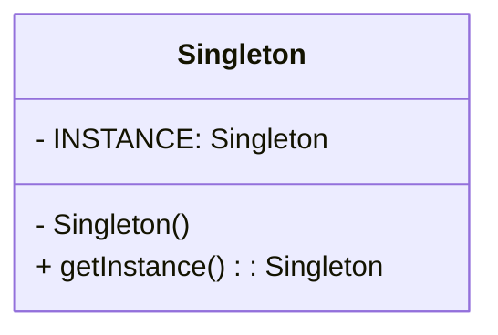
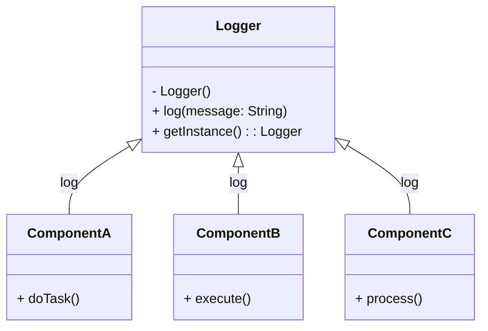

# Singleton

> [!NOTE]
> Find source code [here](https://github.com/amritpandey23/design_patterns_java/tree/master/com.amrit.designpatterns.creational/src/com/amrit/designpatterns/creational/singleton/example/db)

## What is the Singleton pattern?

The Singleton pattern allows global, single-point access to just one unique instance of an object during runtime. By using the Singleton pattern, we ensure that only one instance of an object is created, and any future instantiations are prevented.

### Concepts

- Only one instance is instantiated.
- Guarantees control of a resource.
- Lazily loaded.
- Examples:
  - Runtime
  - Logger
  - Garbage Collector

### Design

- Class is responsible for its lifecycle.
- Static in nature.
- Needs to be thread-safe.
- Private instance.
- Private constructor.
- No parameters!



## Where do we use it?

We use Singleton when multiple components of a program need to utilize a common functionality that must be served by only one object. A typical example is a logger. A logger only needs to exist once in the program's runtime because its functionality is global and can be reused by many components.



## Recipe for Singleton

### Follow the steps to convert an object to a singleton object:

1. Make the constructor private.
2. Declare a private static variable with the object's type, let's call it `instance`.
3. Create a static public method `getInstance()` that creates and returns the object, storing this object in the `instance` variable upon the first creation.

Here is the original object:

```java
class MyObjectClass {
    public MyObjectClass() {}
}
```

Modify the class as follows:

```java
class MyObjectClass {
    private static MyObjectClass instance;

    private MyObjectClass() {}

    public static MyObjectClass getInstance() {
        if (instance == null) {
            instance = new MyObjectClass();
        }
        return instance;
    }
}
```

In Java, we may encounter the double creation of an object instance when running the `getInstance()` method from multiple threads. To prevent this, we can use various workarounds as follows:

### Eager Instantiation

```java
class MyObjectClass {
    private static MyObjectClass instance = new MyObjectClass();

    private MyObjectClass() {}

    public static MyObjectClass getInstance() {
        return instance;
    }
}
```

### Synchronization

```java
class MyObjectClass {
    private static MyObjectClass instance;

    private MyObjectClass() {}

    public static MyObjectClass getInstance() {
        if (instance == null) {
            synchronized (MyObjectClass.class) {
                if (instance == null) {
                    instance = new MyObjectClass();
                }
            }
        }
        return instance;
    }
}
```

### Lazy Loading

```java
class MyObjectClass {
    private static class LazyLoader {
        public static final MyObjectClass INSTANCE = new MyObjectClass();
    }

    private MyObjectClass() {}

    public static MyObjectClass getInstance() {
        return LazyLoader.INSTANCE;
    }
}
```

## Template

Here is a template for a Singleton class in Java:

```java
class Singleton {
    private static class LazyLoader {
        public static final Singleton INSTANCE = new Singleton();
    }

    private Singleton() {}

    public static Singleton getInstance() {
        return LazyLoader.INSTANCE;
    }
}
```

Here is a template for a Singleton class in Python:

```python
class Singleton:
    class _LazyLoader:
        INSTANCE = None

    def __new__(cls):
        if Singleton._LazyLoader.INSTANCE is None:
            Singleton._LazyLoader.INSTANCE = super(Singleton, cls).__new__(cls)
        return Singleton._LazyLoader.INSTANCE
```

## Pitfalls

- Difficult to unit test.
- Requires thread safety.
- Cannot use parameters to modify behavior.
