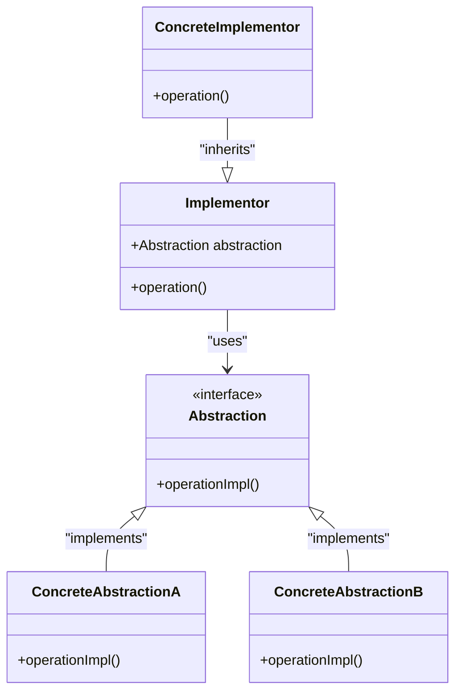

# Bridge

> [!NOTE]
> Find source code [here](https://github.com/amritpandey23/design_patterns_java/tree/master/com.amrit.designpatterns.structural/src/com/amrit/designpatterns/structural/bridge)

## Introduction

- Bridge pattern is used to change the part of the code which is exposed to the user (abstraction) without changing the underlying implementation.
- It is about creating flexible abstraction which can work with mutliple implementation and vice-versa.
- Example: Java Database Connector (JDBC).

## Design



## Example

Take for example a server having logic to send content to the view which can be either a mobile view and desktop view. Since both the views will have different properties to render the content for example both will have different dimensions, the rendering operation will be different. Here we can call the views as abstraction and the server as implementation.

We will use bridge pattern to decouple abstraction from implementation as follows:

Creating abstraction for views as follows:

```java
public interface DisplayView {
	public void display(String content);
}
```

```java
public abstract class AbstractDisplayView implements DisplayView {
	protected abstract void dimensions();
}
```

Now we will create concrete implementations of the abstractions as follows:

```java
public class MobileView extends AbstractDisplayView {
	@Override
	protected void dimensions() {
		System.out.println("Mobile View");
		System.out.println("Dimensions = 640 px X 840 px");
	}

	@Override
	public void display(String content) {
		dimensions();
		System.out.println("---");
		System.out.println("Content");
		System.out.println("---");
		System.out.println(content);
	}
}
```

```java
public class DesktopView extends AbstractDisplayView {
	@Override
	public void dimensions() {
		System.out.println("Desktop View");
		System.out.println("Dimensions = 1080 px X 720 px");
	}

	@Override
	public void display(String content) {
		dimensions();
		System.out.println("---");
		System.out.println("Content");
		System.out.println("---");
		System.out.println(content);
	}
}
```

Our abstractions are complete, now we will work on our implementation:

```java
public interface BackendServer {
	public String getContent();
	public void renderContent(DisplayView view);
}
```

```java
public class MyServer implements BackendServer {
	private final String content;

	public MyServer(String content) {
		this.content = content;
	}

	@Override
	public String getContent() {
		return this.content;
	}

	@Override
	public void renderContent(DisplayView view) {
		view.display(content);
	}
}
```

Here is how all of this works together:

```java
public class Play {
	public static void main(String[] args) {
		BackendServer myFirstServer = new MyServer("Here is some of my content"); // implementation 1

		DisplayView desktopView = new DesktopView(); // abstraction 1
		myFirstServer.renderContent(desktopView);

		DisplayView mobileView = new MobileView(); // abstraction 2
		myFirstServer.renderContent(mobileView);

		BackendServer mySecondServer = new MyServer("Here is some more of my content"); // implementation 2
		mySecondServer.renderContent(desktopView);
		mySecondServer.renderContent(mobileView);
	}
}
```

Here we separate the abstraction (`DisplayView`) from its implementation (`BackendServer`).

In this example:

- `BackendServer` serves as the "implementor" interface.
- `MyServer` is the concrete implementation of `BackendServer`.
- `DisplayView` is the abstraction, representing different ways to display the content.
- `DesktopView` and `MobileView` are concrete implementations of `DisplayView` representing different platforms (desktop and mobile).

By having `server.renderContent(desktopView)` and `server.renderContent(mobileView)`, you allow the server to render content on different views (desktop and mobile), demonstrating how the abstraction (`DisplayView`) and implementation (`BackendServer`) can vary independently.

## Pitfalls

- Complex in nature.
- Planning is required to design the concept.
