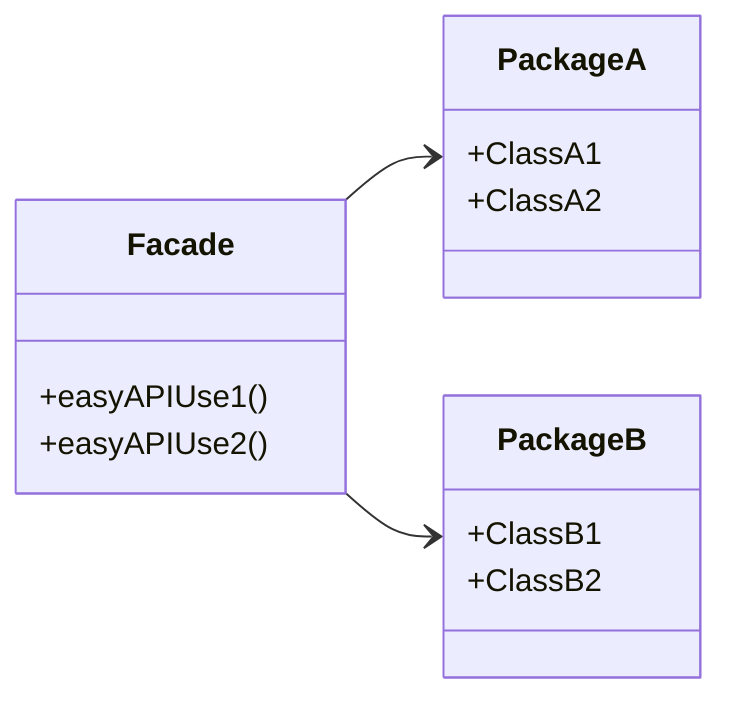

# Facade Pattern

> [!NOTE]
> Find source code [here](https://github.com/amritpandey23/design_patterns_java/tree/master/com.amrit.designpatterns.structural/src/com/amrit/designpatterns/structural/facade)

- Used to simplify and unify complex APIs, offering a cohesive and streamlined interface for client code.
- Promotes refactoring by encapsulating complex subsystems behind a single interface.
- Enhances usability and readability of codebases by providing a clear entry point for interaction with underlying systems.

## Example

An example of the Facade Pattern is seen in `java.net.URL`, where a single class provides simplified methods to handle network connections and resources.

## Design

The pattern involves composing multiple classes to form a facade that encapsulates their functionality. It emphasizes composition over inheritance.



## Demo

Consider a `TravelAgency` facade for booking flights and visas:

```java
// Airline service
class FlyNowAirlines {
    public FlightDetails search(String source, String destination) {
        // Implementation
    }

    public String book(String flightNumber, int seats) {
        // Implementation
    }

    public boolean pay(String paymentId) {
        // Implementation
    }
}

// Visa service
class XVisaServices {
    public String apply(Details userDetails) {
        // Implementation
    }

    public boolean crossVerificationPayment(String paymentId) {
        // Implementation
    }
}

// Facade for travel agency
class TravelAgency {
    private XVisaServices visa = new XVisaServices();
    private FlyNowAirlines airlines = new FlyNowAirlines();

    public void bookTickets(String source, String destination, Details userDetails) {
        if (!areNotInSameCountry(source, destination)) {
            String paymentId = visa.apply(userDetails);
            if (visa.crossVerificationPayment(paymentId)) {
                FlightDetails fd = airlines.search(source, destination);
                String ticketPaymentId = airlines.book(fd.flightNumber, userDetails.seats);
                airlines.pay(ticketPaymentId);
            }
        } else {
            FlightDetails fd = airlines.search(source, destination);
            String ticketPaymentId = airlines.book(fd.flightNumber, userDetails.seats);
            airlines.pay(ticketPaymentId);
        }
    }

    private boolean areNotInSameCountry(String source, String destination) {
        // Implementation
    }
}
```

This example illustrates how a `TravelAgency` facade simplifies complex interactions with airline (`FlyNowAirlines`) and visa (`XVisaServices`) services.

## Pitfalls

- Often used to mitigate poor API design, which may indicate underlying architectural issues.
- Requires thoughtful API design to ensure the facade is intuitive and efficient.
- Avoids inheritance in favor of composition to maintain flexibility and simplicity.
- Overusing the Facade Pattern can obscure underlying API complexities.
