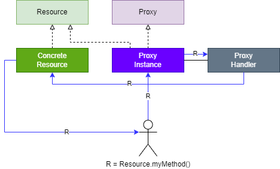

# Proxy

## Introduction

- Proxy design pattern is used to put a Proxy object infront of actual resource object.
- Access to the resource is provided via a proxy.
- It is used to added extra layer of security and access to the existing resources.
- Example: Proxy class in Java.

## Design

- Wrap a real object with proxy.
- Add extra functionality in the proxy for the object.
- Proxy is called to access the real object.



## Example

### Java Proxy class

We will create a `Sensitive Resource` interface for creating concrete resources that will have one method `doIt` to print user messages.
We have a requirement that whenever the method is run in the resource object then it should be logged for future debugging. For this we will create a proxy class for the resource object.

```java
public interface SensitiveResource {
	public void doIt(String message);
}
```

```java
public class Resource implements SensitiveResource {

	@Override
	public void doIt(String message) {
		System.out.println("Message: " + message);
	}

}
```

The logging invocation handler is a handler which the proxy class will call before deligating the method call to the `doIt` method in the resource object.

```java
public class LoggingInvocationHandler implements InvocationHandler {
	private Object target;

	public LoggingInvocationHandler(Object target) {
		this.target = target;
	}

	@Override
	public Object invoke(Object proxy, Method method, Object[] args) throws Throwable {
		// logging the class run
		System.out.println(target.getClass().getName() + " ran method '" + method.getName() + "' with arguments: "
				+ Arrays.toString(args));
		return method.invoke(target, args);
	}

}
```

Below code demonstrate the use of Proxy class.

```java
public class Play {
	public static void main(String[] args) {
		SensitiveResource resource = new Resource();

		// Java proxy instance for resource object
		SensitiveResource proxyResource = (SensitiveResource) Proxy.newProxyInstance(resource.getClass().getClassLoader(),
				new Class<?>[] { SensitiveResource.class }, new LoggingInvocationHandler(resource));

		proxyResource.doIt("This is my message");
	}
}
```

### Image example

In this example we will create our proxy class called `ImageProxy` which will cache images for the same image file path. In case the user/client request same image, it's first looked up in the cache and the the image is display or sent to the user.

```java
public interface Image {
	public void display();
}
```

```java
public class ConcreteImage implements Image {
	private String imagePath;

	public ConcreteImage(String imagePath) {
		this.imagePath = imagePath;
	}

	@Override
	public void display() {
		System.out.println("Displaying image from: " + imagePath);
	}
}
```

```java
public class ImageProxy implements Image {
	private String imagePath;

	private static Map<String, Image> images = new HashMap<>();

	public ImageProxy(String imagePath) {
		this.imagePath = imagePath;
	}

	@Override
	public void display() {
		// lookup cached images
		if (!images.containsKey(imagePath)) {
			images.put(imagePath, new ConcreteImage(imagePath));
		}

		System.out.println("Concrete image memory address: " + images.get(imagePath));

		// display images from cache
		images.get(imagePath).display();
	}
}
```

And the following code demonstrate the use of `ImageProxy` class to deligate the method call to the display image to concrete image class.

```java
public class Play {
	public static void main(String[] args) {
		Image image1 = new ImageProxy("sample.jpg");
		image1.display();

		Image image2 = new ImageProxy("sample.jpg");
		image2.display(); // image from the cache
	}
}
```

## Pitfalls

- Only one proxy is allowed for all kinds of operations like logging, security, caching etc.
- One extra layer of abstraction.
- Maintainence of handlers.
